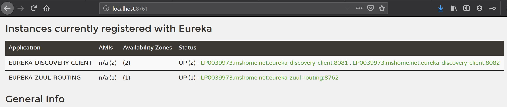

## Technical Stack
* JDK 1.8
* Spring Boot 2.1.7
* Spring Boot eureka-server
* Spring Boot eureka-discovery-client
* Spring Boot zuul

## Design 
* eureka-server
	* It is an application where eureka server configuration resides. This acts as registry for all services.
	* To run this application use command `mvn spring-boot:run` or `java -jar eureka-server.jar
* eureka-discovery-client
	* This is an application which has configuration about eureka server to connect and register as a member.
	* To run the application `mvn spring-boot:run -Dserver.port=<8081/8082>` or `java -jar eureka-discovery-client.jar -Dserver.port=<8081/8082>
* eureka-zuul-routing
	* It is another eureka discovery client application, however added with spring-zuul-routing framework for routing the service access.
	* To run the application use command `mvn spring-boot:run` or `java -jar eureka-zuul-routing.jar`

## Local Implementation Access URLs:
* Eureka Server URL: http://localhost:8761/
* Individual Service Access URL: http://localhost:8081/sayHello, http://localhost:8082/sayHello
* Zuul URL to access Service: http://localhost:8762/eureka-discovery-client/sayHello

Eureka Server Console URL with discovery-clients

